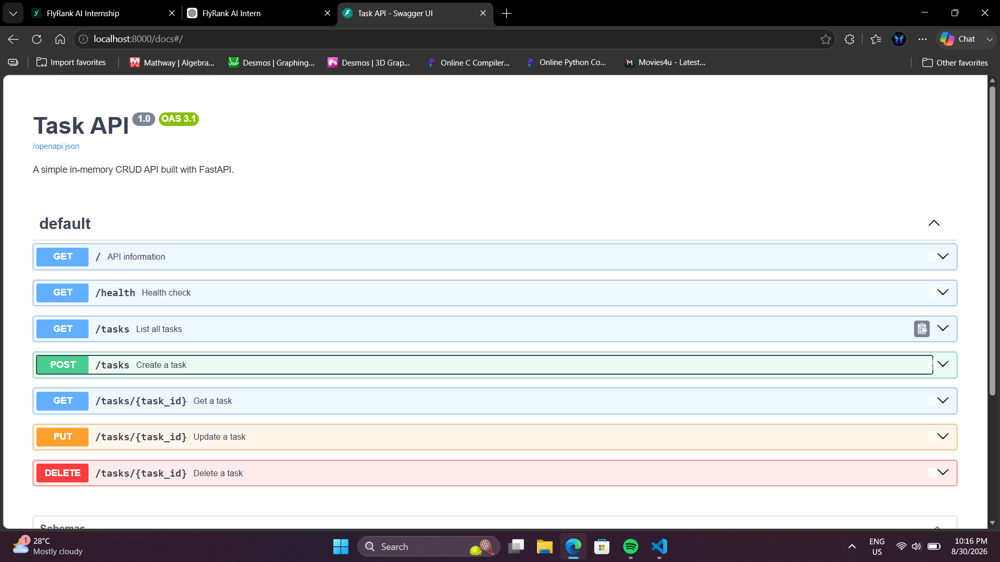

# Task API

A simple **in-memory CRUD API** built with **Python, FastAPI, and Swagger UI**.

This project was built stage-by-stage as part of the FlyRank AI backend/API assignment.

## Features

* Create tasks
* Read all tasks
* Read a single task
* Update tasks
* Delete tasks
* Input validation
* JSON error responses
* Interactive Swagger UI
* In-memory storage
* RESTful HTTP status codes

> **Note:** Tasks are stored only in memory. Restarting the server resets the task list to the three default tasks.

---

## Requirements

* Python 3.10+
* pip

---

## Installation & Run

Clone the repository and enter the project directory:

```bash
git clone <YOUR_GITHUB_REPO_URL>
cd FL04-task-crud-api
```

Create and activate a virtual environment:

### Windows PowerShell

```powershell
python -m venv .venv
.venv\Scripts\Activate.ps1
```

Install dependencies:

```powershell
pip install -r requirements.txt
```

Start the server:

```powershell
uvicorn main:app --reload
```

The API will be available at:

```text
http://localhost:8000
```

Swagger UI:

```text
http://localhost:8000/docs
```

---

## API Endpoints

| Method | Endpoint           | Description     | Success         |
| ------ | ------------------ | --------------- | --------------- |
| GET    | `/`                | API information | 200             |
| GET    | `/health`          | Health check    | 200             |
| GET    | `/tasks`           | List all tasks  | 200             |
| GET    | `/tasks/{task_id}` | Get one task    | 200 / 404       |
| POST   | `/tasks`           | Create a task   | 201             |
| PUT    | `/tasks/{task_id}` | Update a task   | 200 / 400 / 404 |
| DELETE | `/tasks/{task_id}` | Delete a task   | 204 / 404       |

### Validation

`POST` and `PUT` require a non-empty `title`.

Invalid requests return:

```json
{
  "error": "Title is required and cannot be empty"
}
```

Unknown task IDs return:

```json
{
  "error": "Task 999 not found"
}
```

---

## Example Request

Create a task:

```bash
curl -i -X POST http://localhost:8000/tasks \
  -H "Content-Type: application/json" \
  -d '{"title":"Buy milk"}'
```

Example response:

```text
HTTP/1.1 201 Created
content-type: application/json

{"id":4,"title":"Buy milk","done":false}
```

---

## Swagger UI

FastAPI automatically generates interactive OpenAPI documentation.

Open:

`http://localhost:8000/docs`

The Swagger UI can be used to execute the complete CRUD cycle without curl:

1. Create a task
2. List tasks
3. Get the task
4. Update the task
5. Delete the task

### Swagger Screenshot



---

## Project Structure

```text
FL04-task-crud-api/
├── main.py
├── requirements.txt
├── README.md
└── docs/
    └── swagger.png
```

---

## Storage

This API intentionally uses an **in-memory Python list** instead of a database or files.

This means data exists only while the server is running.

If the server is restarted, newly created tasks disappear and the three default tasks are restored.

This demonstrates the difference between temporary in-memory state and persistent database storage.
